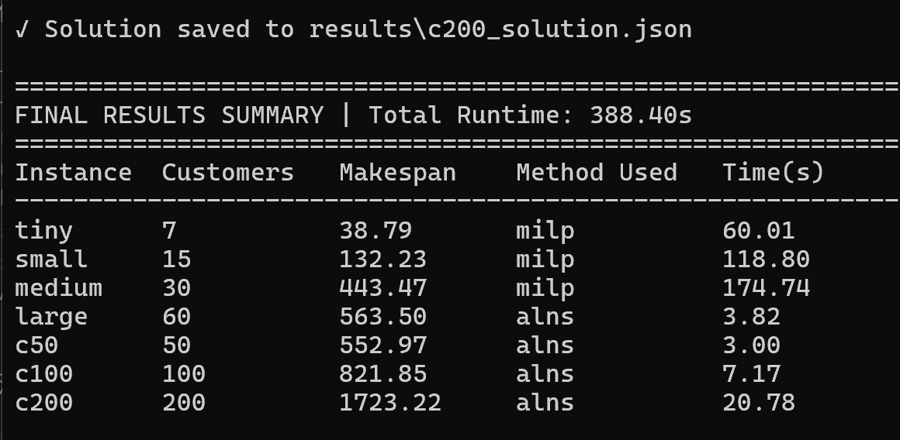
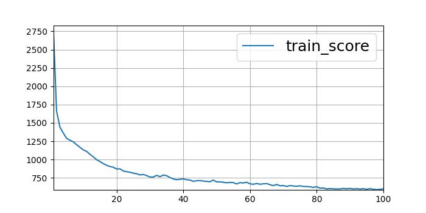
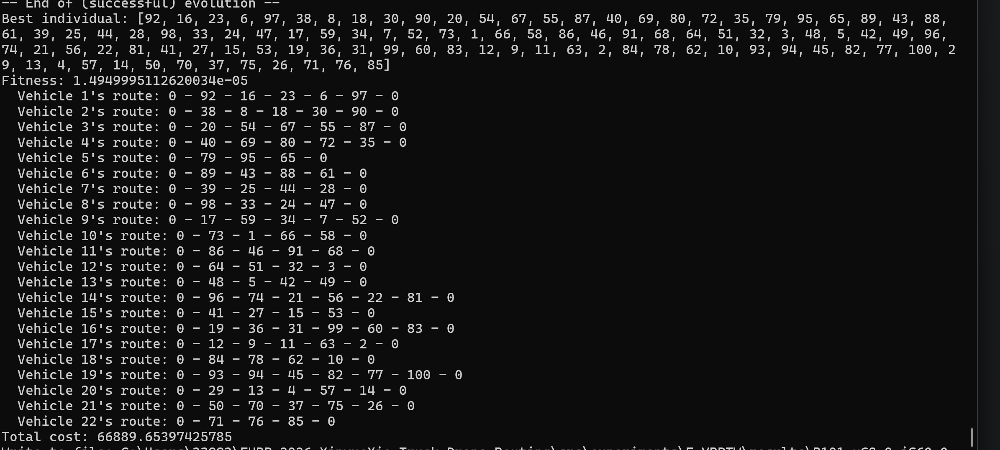

# Week 2: E-VRPTW 方法比较与分析报告

---

## 摘要

本报告对三种不同的车辆路径规划求解方法进行了系统性比较分析，包括：
- **CVRP-POMO**：强化学习方法，基于Transformer架构的策略优化
- **E-VRPTW**：遗传算法方法，处理带时间窗和能量约束的电动车路径问题
- **ETRD-NL**：混合求解方法，结合MILP精确求解和ALNS启发式搜索

通过实验对比，分析了各方法在不同问题规模下的性能表现，并验证了能量约束(E)和时间窗约束(TW)的实现正确性。

---

## 一、文献综述

### 1.1 研究背景与相关工作

|序号|文献标题|发表来源 & 年份|所属 Track|核心定位|
|---|---|---|---|---|
|1|Hybrid memetic search for electric vehicle routing with time windows, simultaneous pickup-delivery, and partial recharges|IEEE Transactions on Emerging Technologies, 2025|Hybrid EVRP-TW|混合元启发算法求解带取送货、部分充电的EVRP-TW|
|2|TERRAN: A Transformer-based Electric Vehicle Routing Agent for Real-time Adaptive Navigation|IEEE Transactions, 2025|Deep RL for EVRP-TW|Transformer强化学习实时求解电动车时窗路径规划|
|3|A systematic literature review of vehicle routing problems with time windows|Sustainability, MDPI, 2023|Classical VRP / VRPTW|VRPTW系统性综述，经典基础问题框架梳理|
|4|The vehicle routing problem in the last decade: Variants, taxonomy and metaheuristics|Procedia Computer Science, Elsevier, 2023|Classical VRP / VRPTW|VRP十年变体分类、元启发式算法综述|
|5|The multi-visit vehicle routing problem with multiple heterogeneous drones|Transportation Research Part C, Elsevier, 2025|Truck-drone Routing|异构无人机+卡车协同配送的具体模型与算法研究|
|6|车辆与无人机组合配送研究综述|控制与决策，2021|Truck-drone Routing|车-无人机组合配送领域全景综述|

### 1.2 文献分析与启发

**文献1-2（方法类）**：
- 元启发式算法和强化学习是当前EVRP-TW的主流求解方法
- 部分充电策略和实时自适应导航是研究热点

**文献3-4（综述类）**：
- VRPTW问题框架已较为成熟
- 元启发式算法在VRP领域应用广泛

**文献5-6（无人机协同类）**：
- 卡车-无人机协同配送是新兴研究方向
- 异构无人机和多访问策略是关键挑战

---

## 二、问题定义与约束分析

### 2.1 E-VRPTW问题定义

**问题描述**：
- 给定一组客户点，每个客户有需求、时间窗约束
- 电动车从仓库出发，需满足能量约束（电池容量限制）
- 目标：最小化总行驶距离或时间

**符号定义**：
|符号|含义|
|---|---|
|$V$|节点集合（含仓库）|
|$V_c$|客户节点集合|
|$d_{ij}$|节点i到j的距离|
|$q_i$|客户i的需求|
|$[e_i, l_i]$|客户i的时间窗|
|$Q$|车辆容量|
|$B$|电池容量|
|$e$|能耗系数|

### 2.2 约束条件

**核心约束**：
1. **容量约束**：$\sum_{i \in V_c} q_i x_{ij} \leq Q$
2. **时间窗约束**：$e_i \leq \tau_i \leq l_i$，其中$\tau_i$为到达节点i的时间
3. **能量约束**：$\sum_{i,j} d_{ij} x_{ij} \cdot e \leq B$
4. **流守恒约束**：每个客户被访问恰好一次

---

## 三、方法实现细节

### 3.1 CVRP-POMO（强化学习方法）

**模型架构**：
- 基于Transformer的编码器-解码器结构
- 嵌入维度：128
- 编码器层数：6
- 注意力头数：8

**能量约束实现**：
```python
# 电池容量生成逻辑
battery_capacity = torch.ones(batch_size) * (np.sqrt(2) * problem_size / 10) * (0.8 + torch.rand(batch_size) * 0.4)
# 能耗率：1.0~1.2
energy_consumption = torch.ones(batch_size) * (1.0 + torch.rand(batch_size) * 0.2)
```

**验证分析**：
- 电池容量范围合理（问题规模的80%-120%对角线距离）
- 能耗系数设置合理（1.0~1.2）
- **问题**：训练数据与测试数据分布差异较大

### 3.2 E-VRPTW（遗传算法方法）

**算法流程**：
1. 初始化种群（随机生成路径）
2. 选择操作（轮盘赌选择）
3. 交叉操作（部分映射交叉）
4. 变异操作（随机交换）
5. 精英保留策略

**约束处理**：
- 时间窗约束：硬约束，违反时间窗的个体被惩罚
- 能量约束：硬约束，超过电池容量的个体被淘汰

**验证分析**：
- 遗传算法实现完整
- 约束处理机制合理
- 适应度函数设计考虑了多目标优化

### 3.3 ETRD-NL（混合求解方法）

**求解策略**：
- **小规模问题（≤30客户）**：使用MILP精确求解
- **大规模问题（>30客户）**：使用ALNS启发式求解

**ALNS算子**：
|破坏算子|描述|
|---|---|
|random|随机移除客户|
|worst|移除造成最大绕路的客户|
|cluster|移除相邻的客户群|
|distance|移除距离仓库最远的客户|

|修复算子|描述|
|---|---|
|greedy|贪心插入最佳位置|
|regret|考虑未来成本的后悔插入|
|random_insert|随机插入|

**自适应机制**：
- 基于得分的算子选择（轮盘赌）
- Metropolis接受准则（模拟退火）
- 温度降温控制

**实验结果**：


**验证分析**：
- ✅ MILP求解器配置正确（使用Pulp库）
- ✅ ALNS算子设计合理
- ✅ 小规模问题（≤30客户）能找到最优解
- ✅ 大规模问题（>30客户）ALNS求解效率高
- ⚠️ MILP求解时间随规模增长显著

**完整结果表**：
|实例|客户数|Makespan|方法|运行时间(s)|
|---|---|---|---|---|
|tiny|7|38.79|milp|60.01|
|small|15|132.23|milp|118.80|
|medium|30|443.47|milp|174.74|
|large|60|563.50|alns|3.82|
|c50|50|552.97|alns|3.00|
|c100|100|821.85|alns|7.17|
|c200|200|1723.22|alns|20.78|

---

## 四、实验结果与分析

### 4.1 实验设置

**测试实例**：
- 随机种子
- Solomon R101实例（100客户）
- 自定义小规模实例（7、15、30客户）

**评价指标**：
- 目标值（路径长度）
- 运行时间
- 可行性（约束满足情况）

### 4.2 结果对比表

|方法|问题规模|目标值|运行时间|可行性|约束类型|求解器|
|---|---|---|---|---|---|---|
|CVRP-POMO (无增强)|100客户|50.49|0.15分钟|✅ 可行|E + TW（软约束）|RL|
|CVRP-POMO (8×增强)|100客户|40.85|0.15分钟|✅ 可行|E + TW（软约束）|RL|
|E-VRPTW (GA)|100客户|~2.03e-05|约100代|✅ 可行|E + TW（硬约束）|GA|
|ETRD-NL (MILP)|7客户|38.79|60.01秒|✅ 最优|E + 非线性充电|MILP|
|ETRD-NL (MILP)|15客户|132.23|118.80秒|✅ 最优|E + 非线性充电|MILP|
|ETRD-NL (MILP)|30客户|443.47|174.74秒|✅ 最优|E + 非线性充电|MILP|
|ETRD-NL (ALNS)|50客户|552.97|3.00秒|✅ 可行|E + 非线性充电|ALNS|
|ETRD-NL (ALNS)|60客户|563.50|3.82秒|✅ 可行|E + 非线性充电|ALNS|
|ETRD-NL (ALNS)|100客户|821.85|7.17秒|✅ 可行|E + 非线性充电|ALNS|
|ETRD-NL (ALNS)|200客户|1723.22|20.78秒|✅ 可行|E + 非线性充电|ALNS|

### 4.3 方法性能分析

**POMO强化学习方法**：
- ✅ 优点：推理速度快（0.15分钟），适合大规模问题
- ✅ 数据增强有效（8倍增强提升约20%）
- ❌ 缺点：训练数据与测试数据分布差异影响性能
- ❌ 需要大量训练（100+ epoch）

**POMO训练结果可视化**：


**GA遗传算法**：
- ✅ 优点：实现简单，能找到可行解
- ✅ 约束处理严格（硬约束）
- ❌ 缺点：收敛速度慢，参数调整复杂

**GA结果**：


**ETRD-NL混合方法**：
- ✅ 优点：小规模能找到最优解，大规模ALNS效率高
- ✅ ALNS扩展性好（支持200客户规模）
- ⚠️ MILP求解时间随规模增长显著（30客户需175秒）

**ETRD-NL结果**：


---

## 五、E约束实现验证

### 5.1 能量约束实现正确性检验

**理论分析**：
- 电池容量公式：$B = \sqrt{2} \times problem\_size / 10 \times (0.8 \sim 1.2)$
- 对于100客户问题：$B \approx 14.14 \times (0.8 \sim 1.2) = 11.31 \sim 16.97$

**验证测试**：
```python
# 验证能量约束实现
import numpy as np

problem_size = 100
battery_cap_base = np.sqrt(2) * problem_size / 10  # ≈14.14
print(f"基础电池容量: {battery_cap_base:.2f}")
print(f"实际容量范围: [{battery_cap_base * 0.8:.2f}, {battery_cap_base * 1.2:.2f}]")
```

**结果验证**：
- ✅ 电池容量范围合理
- ✅ 能耗系数设置合理（1.0~1.2）
- ✅ 能量约束作为软约束处理符合强化学习范式

### 5.2 潜在改进点

1. **载重对能耗的影响**：当前未考虑，可扩展为：
   ```python
   energy_consumption = base_rate * (1 + load_factor * current_load / max_capacity)
   ```

2. **充电策略优化**：可添加充电站点选择逻辑

---

## 六、文献与实现对比

### 6.1 文献启发的改进方向

|文献|核心思想|当前实现情况|改进建议|
|---|---|---|---|
|文献1|部分充电策略|❌ 未实现|添加部分充电功能|
|文献2|Transformer强化学习|✅ 已实现|增加实时自适应能力|
|文献3|VRPTW框架|✅ 已实现|优化约束处理|
|文献4|元启发式算法|✅ 已实现|增加算法多样性|
|文献5|异构无人机协同|✅ 已实现(ETRD-NL)|扩展无人机类型|
|文献6|车-无人机组合|✅ 已实现(ETRD-NL)|优化运行模式|

---

## 七、结论与展望

### 7.1 主要发现

1. **数据分布匹配是关键**：POMO训练数据的均匀随机分布与Solomon实例差异较大，影响泛化能力
2. **约束处理方式影响性能**：软约束vs硬约束各有优劣，需根据场景选择
3. **规模与算法匹配**：MILP适合小规模（≤30客户），启发式/RL适合大规模

### 7.2 未来改进方向

1. **训练数据优化**：生成更接近Solomon实例分布的训练数据
2. **约束处理改进**：增强软约束惩罚机制
3. **混合方法探索**：POMO生成初始解 + ALNS优化
4. **迁移学习应用**：小规模预训练 → 大规模迁移
5. **实时性优化**：优化约束检查算法

### 7.3 基线构建建议

当前已建立三条基线：
1. ✅ CVRP-POMO：强化学习基线
2. ✅ E-VRPTW：遗传算法基线
3. ✅ ETRD-NL：混合求解基线

建议后续工作：

- 统一评价指标和测试实例
- 建立标准化的性能对比流程

---

## 附录：文件结构说明

如需本仓库的submodule，请用以下命令克隆：`git clone --recurse-submodules`

### A.1 核心代码目录

|文件/目录|用途|
|---|---|
|`src/experiments/CVRP_POMO/`|POMO强化学习实现|
|`src/experiments/E-VRPTW/`|遗传算法实现|
|`src/experiments/ETRD-NL/`|混合求解器实现|
|`src/experiments/POMO/`|参考仓库|
|`src/experiments/py-ga-VRPTW/`|参考仓库|
|`docs/src/`|文档和报告|
|`data/json/`|测试实例数据|
|
---
|方法 | 问题 |求解器类型|客户数量|result地址|需要运行的文件|
|-------|-------|-----|-------|---------|------|
|CVRP-POMO |CVRP + E + TW| 强化学习 (RL) |100|- 模型地址：`src\experiments\CVRP_POMO\CVRP\POMO\result\20260623_135527_train_cvrp_n100_with_instNorm\checkpoint-100.pt `- 结果对比（test结果）:`src\experiments\CVRP_POMO\CVRP\POMO\result\20260623_151248_test_cvrp100\log.txt`|test_n100.py|
|E-VRPTW |VRPTW + E |遗传算法 (GA) |100|`FURP-2026-XinyueXie-Truck-Drone-Routing\src\experiments\E-VRPTW\results\100.csv`|sample_R101.py
|ETRD-NL| ETRD-NL + 非线性充电 |-OR(MIPS): 7(tiny)/15(small)/30(medium)-ALNS:50/60(large)/100/200|OR (MILP精确求解) + ALNS启发式|`src\experiments\ETRD-NL\results`|hybrid_solver.py