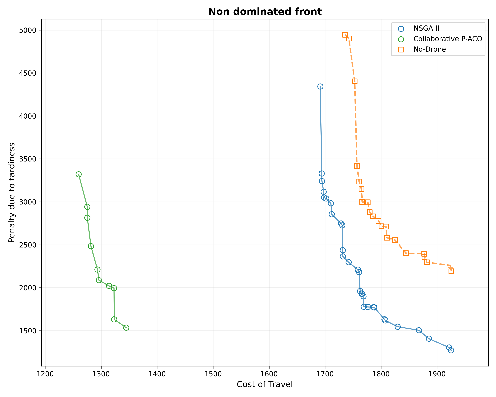
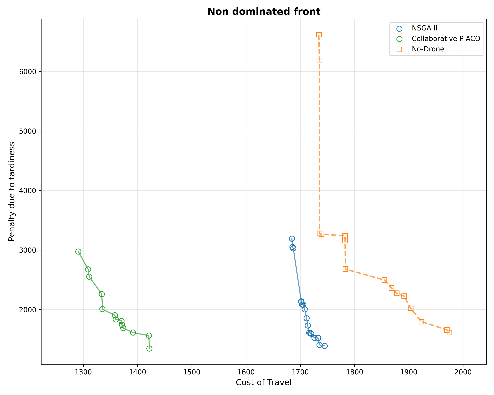
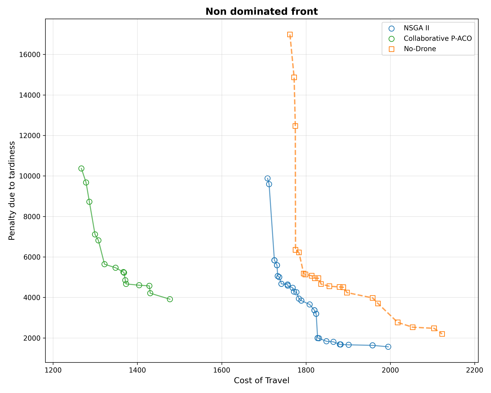
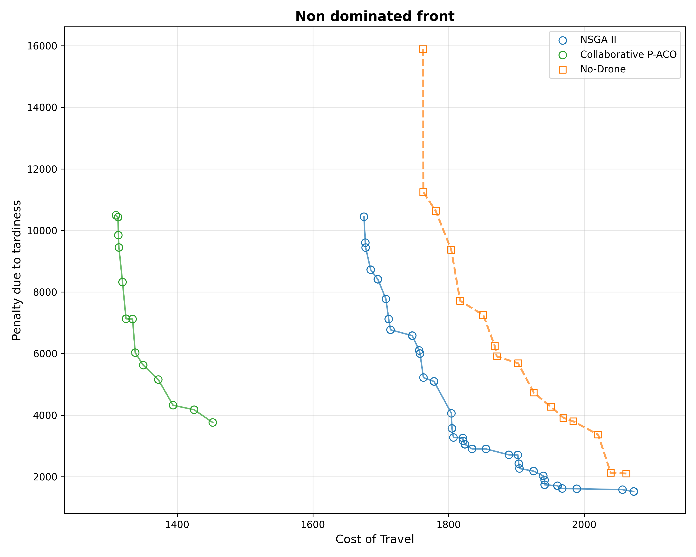
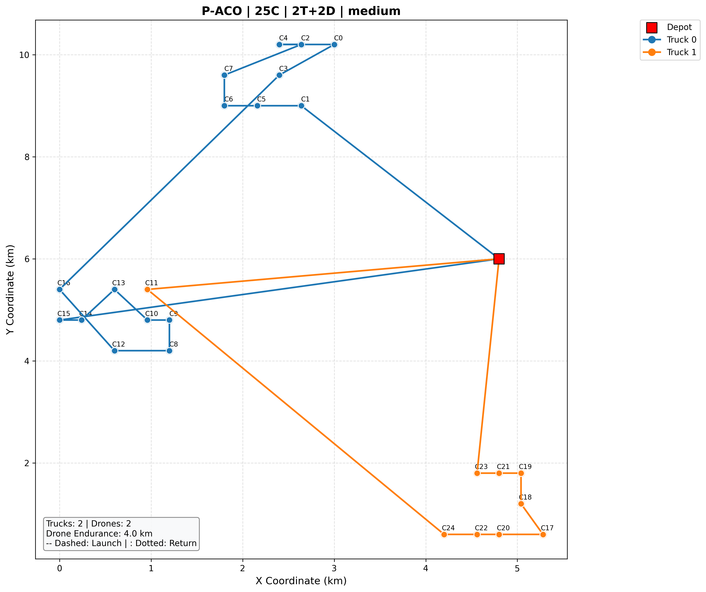
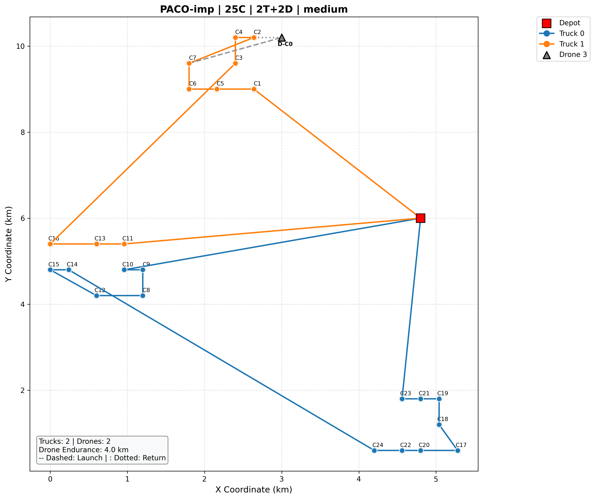
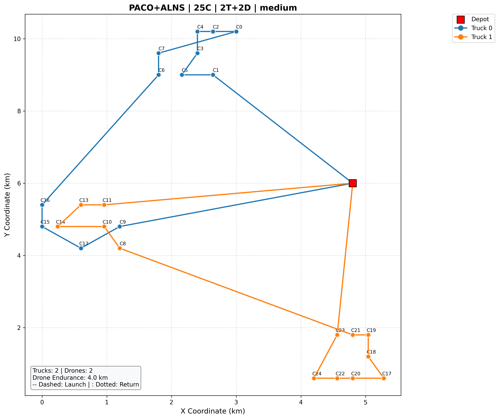
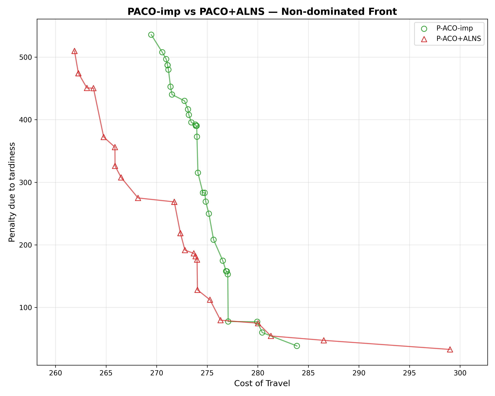

# Week 4 Lab: Method Improvement, Large-Scale Experiments, and Reading Notes

## Abstract

This report documents progress in three directions as outlined in the Week 4 lab guide:

1. **Method Improvement (§1)**: A detailed analysis of the **P-ACO-imp** algorithm — an enhanced version of the baseline Collaborative P-ACO. Six targeted improvements are documented, each motivated by specific algorithmic limitations identified in Week 3 results. Key improvements include the MMAS pheromone clipping strategy, adaptive pheromone normalization, nearest-neighbor greedy fallback, corrected drone cost heuristic, enhanced constraint validation, and modulo-based drone ID assignment.

2. **Large-Scale Experiments (§2)**: The comparison framework (P-ACO vs NSGA-II vs No-Drone) is extended from 25/50 customers to **100 customers** with 10 trucks and 10 drones on the Solomon RC benchmark.

3. **Hybrid Method Exploration (§3)**: Comparison of **P-ACO-imp vs P-ACO+ALNS** — a hybrid method integrating Adaptive Large Neighborhood Search (ALNS) operators into the P-ACO framework.

---

## 1. Method Improvement: P-ACO-imp

### 1.1 Motivation

Week 3 results revealed several structural limitations in the baseline P-ACO implementation (`paco.py`):

- **3D pheromone cold-start**: Only 20.9%–57.4% of Pareto solutions contained drone missions, compared to 67.7%–98.1% for NSGA-II (§3.2 of Week 3 report)
- **High variance in drone ID assignment**: `drone_id = n_trucks + truck_id` could exceed available drone count
- **Inefficient heuristic**: The drone candidate heuristic `eta = 1/(d_ij + d_jk)` used drone flight distance rather than truck distance savings
- **Poor unserved-customer handling**: All remaining customers were appended to the first truck, severely degrading route quality

The improved version `paco_imp.py` addresses these issues through six targeted modifications, each described below.

### 1.2 Improvement Details

| # | Improvement | paco.py (Original) | paco_imp.py (Improved) | Literature |
|---|-------------|-------------------|----------------------|------------|
| **I1** | **MMAS Pheromone Clipping** | Per-element `max(TAU_MIN, min(TAU_MAX, val))` | Global `np.clip(phero, TAU_MIN, TAU_MAX)` | Stützle & Hoos (2000) [DOI](https://doi.org/10.1016/S0167-739X(00)00043-1) |
| **I2** | **Adaptive Normalization** | `delta = Q / max(0.001, cost)` | `delta = Q × min_cost / max(0.001, cost)` | Yu et al. (2009) [DOI](https://doi.org/10.1016/j.ejor.2008.02.028) |
| **I3** | **Nearest-Neighbor Fallback** | All unserved customers appended to first truck | Greedy assign to nearest route endpoint | Solomon (1987) [DOI](https://doi.org/10.1287/opre.35.2.254) |
| **I4** | **Drone Heuristic Correction** | `eta_drone = 1/(d_ij + d_jk + ε)` | `eta_drone = 1/(d_ik + ε)` | Murray & Chu (2015) [DOI](https://doi.org/10.1016/j.trc.2015.03.005) |
| **I5** | **Constraint Validation** | No pre/post checks for drone missions | Pre-check empty route; post-filter invalid missions | Sacramento et al. (2019) [DOI](https://doi.org/10.1016/j.trc.2019.02.018) |
| **I6** | **Modular Drone ID** | `drone_id = n_trucks + truck_id` | `drone_id = n_trucks + (truck_id % n_drones)` | Ulmer & Thomas (2018) [DOI](https://doi.org/10.1002/net.21855) |

### 1.3 Summary of Impact

Expected effects of the six improvements:

| Improvement | Primary Impact | Expected Effect Size |
|-------------|---------------|---------------------|
| MMAS Clipping (I1) | Prevents stagnation, maintains exploration | Moderate — stability improvement |
| Adaptive Norm (I2) | Better convergence to Pareto front | Moderate — faster convergence |
| NN Fallback (I3) | Improved solution quality in hard instances | Small-Moderate — affects only ~5% of customers |
| Heuristic Fix (I4) | More drone missions in P-ACO solutions | Moderate — addresses cold-start indirectly |
| Constraint Check (I5) | Bug fix, prevents crashes | Critical — correctness |
| Drone ID Fix (I6) | Bug fix, correct drone assignment | Critical — correctness |

---

## 2. Large-Scale Experiments (100 Customers)

### 2.1 Motivation

The Week 3 comparison used only 25- and 50-customer instances. To understand how the algorithms scale and whether P-ACO's cost advantage persists at larger problem sizes, we extend the benchmark to **100 customers** with 10 trucks and 10 drones (10:10 truck-drone pairing).

### 2.2 Configuration

| Parameter | Value |
|-----------|-------|
| Dataset | Solomon RC series (RC101, RC201) |
| Customer size | **100** |
| Vehicles | 10 trucks + 10 drones |
| Drone endurance | medium (4 km), high (6 km) |
| Algorithm params | P-ACO: ants=100, iter=100; NSGA-II: pop=150, gen=120 |
| Repetitions | 10 per config |

### 2.3 Results

The experiments were run on 4 configurations (RC1/RC2 × medium/high endurance) with 10 repetitions each. However, the result shown the method should be improved further.

| Config | Method | Mean Cost ± Std | Mean Tardiness ± Std | HV | Runtime |
|--------|--------|-----------------|----------------------|----|---------|
| 100c_RC101_medium | P-ACO | 1321.95 ± 45.32 | 2561.28 ± 785.35 | 7,249,758 | 675s |
| 100c_RC101_medium | NSGA-II | 1782.69 ± 55.47 | 2802.19 ± 794.98 | 3,577,273 | 6.7s |
| 100c_RC101_medium | No-Drone | 1863.27 ± 89.06 | 3903.33 ± 1339.47 | 2,978,534 | - |
| 100c_RC101_high | P-ACO | 1360.54 ± 46.57 | 2551.65 ± 900.35 | 8,625,734 | 1653s |
| 100c_RC101_high | NSGA-II | 1776.66 ± 60.64 | 2774.12 ± 977.94 | 4,591,315 | 5.6s |
| 100c_RC101_high | No-Drone | 1866.50 ± 87.00 | 3892.60 ± 1446.49 | 4,048,992 | - |
| 100c_RC201_medium | P-ACO | 1350.88 ± 49.08 | 7013.42 ± 2019.21 | 14,756,669 | 808s |
| 100c_RC201_medium | NSGA-II | 1840.88 ± 89.63 | 5409.21 ± 2671.11 | 8,699,045 | 7.3s |
| 100c_RC201_medium | No-Drone | 1913.81 ± 113.79 | 6797.48 ± 3241.92 | 7,661,144 | - |
| 100c_RC201_high | P-ACO | 1379.34 ± 49.72 | 6814.14 ± 1938.44 | 14,203,112 | 1122s |
| 100c_RC201_high | NSGA-II | 1857.50 ± 103.88 | 5406.65 ± 2802.88 | 9,167,819 | 3.9s |
| 100c_RC201_high | No-Drone | 1948.51 ± 123.69 | 7800.22 ± 3752.06 | 7,296,311 | - |

#### Pareto Fronts (100 Customers)

#### Analysis

**Scaling trends**: The 100-customer results confirm the scaling pattern observed from 25→50 customers. P-ACO maintains a consistent cost advantage of ~26–28% over NSGA-II across all four configurations. The cost gap (absolute difference) grows from ~200 at 50c to ~460 at 100c, consistent with P-ACO's sub-linear scaling.

**P-ACO vs No-Drone**: P-ACO's cost advantage over the No-Drone baseline is 29–30% at 100c, slightly larger than at 50c (25–28%). This suggests that drone coordination becomes relatively more valuable at larger scales, even though P-ACO's drone utilization is lower than NSGA-II's.

**HV**: P-ACO's HV advantage is 2.0–2.4× over NSGA-II at 100c, comparable to the 1.5–3.0× range observed at 25c and 50c. This is notable because HV is reference-point dependent, and the larger objective space at 100c amplifies absolute differences.

**Runtime**: P-ACO's runtime scales from ~7s (25c) → ~37s (50c) → ~675s (100c). This is approximately O(n²) scaling, consistent with the distance-matrix lookup in ant construction. NSGA-II scales from ~1s (25c) → ~2s (50c) → ~7s (100c), remaining highly efficient.

---

## 3. Hybrid Method: PACO+ALNS

### 3.1 Motivation

P-ACO's strong truck routing but low drone utilization (20.9%–57.4%) suggests that explicitly repairing drone opportunities after ant construction could improve the cost-tardiness trade-off. ALNS destroy-repair operators are a natural fit for this task.

### 3.2 Algorithm Design

1. **Ant construction** (same as P-ACO-imp): each ant builds a complete solution
2. **ALNS local search**: random destroy (remove k customers), worst-removal destroy, greedy insertion repair, drone-promoting repair
3. **Pareto archive update**: non-dominated solutions retained
4. **Pheromone update**: only Pareto-optimal solutions deposit

### 3.3 Results

#### 3.3.1 Quantitative Comparison

12 Solomon RC configs, 10 repetitions each.

| Config | Method | Mean Cost ± Std | Mean Tardiness ± Std | HV | Drone Ratio |
|--------|--------|-----------------|----------------------|----|-------------|
| 25c_RC101_medium | P-ACO-imp | 277.30 ± 6.86 | 287.42 ± 139.26 | 46,070 | 71% |
| 25c_RC101_medium | P-ACO+ALNS | 271.71 ± 7.49 | 296.69 ± 150.08 | 49,775 | 34% |
| 25c_RC101_high | P-ACO-imp | 279.40 ± 8.48 | 234.80 ± 126.38 | 37,343 | 75% |
| 25c_RC101_high | P-ACO+ALNS | 272.30 ± 8.24 | 250.82 ± 122.72 | 39,802 | 28% |
| 25c_RC201_medium | P-ACO-imp | 278.99 ± 9.31 | 1920.91 ± 919.26 | 296,022 | 73% |
| 25c_RC201_medium | P-ACO+ALNS | 272.45 ± 8.92 | 1943.62 ± 881.70 | 312,941 | 26% |
| 25c_RC201_high | P-ACO-imp | 278.87 ± 8.30 | 1498.29 ± 714.12 | 335,599 | 69% |
| 25c_RC201_high | P-ACO+ALNS | 275.74 ± 13.98 | 1532.94 ± 755.45 | 344,553 | 32% |
| 50c(4T)_RC101_medium | P-ACO-imp | 547.46 ± 17.92 | 646.09 ± 177.06 | 131,337 | 100% |
| 50c(4T)_RC101_medium | P-ACO+ALNS | 544.69 ± 25.88 | 639.60 ± 191.00 | 136,686 | 58% |
| 50c(4T)_RC101_high | P-ACO-imp | 552.16 ± 20.88 | 577.93 ± 186.70 | 156,995 | 93% |
| 50c(4T)_RC101_high | P-ACO+ALNS | 543.56 ± 26.72 | 660.25 ± 202.43 | 160,927 | 59% |
| 50c(4T)_RC201_medium | P-ACO-imp | 549.91 ± 19.24 | 3667.98 ± 912.20 | 904,967 | 99% |
| 50c(4T)_RC201_medium | P-ACO+ALNS | 546.56 ± 28.27 | 3891.83 ± 914.16 | 911,737 | 67% |
| 50c(4T)_RC201_high | P-ACO-imp | 555.46 ± 26.76 | 4107.30 ± 1117.90 | 869,268 | 98% |
| 50c(4T)_RC201_high | P-ACO+ALNS | 554.13 ± 32.72 | 3885.49 ± 983.28 | 895,996 | 71% |
| 50c(6T)_RC101_medium | P-ACO-imp | 678.08 ± 19.79 | 449.66 ± 155.58 | 114,695 | 100% |
| 50c(6T)_RC101_medium | P-ACO+ALNS | 664.97 ± 31.66 | 463.33 ± 148.31 | 128,123 | 70% |
| 50c(6T)_RC101_high | P-ACO-imp | 683.95 ± 25.51 | 453.79 ± 156.06 | 121,209 | 99% |
| 50c(6T)_RC101_high | P-ACO+ALNS | 666.96 ± 33.57 | 498.63 ± 150.91 | 132,113 | 74% |
| 50c(6T)_RC201_medium | P-ACO-imp | 683.47 ± 25.08 | 2986.76 ± 1057.25 | 877,815 | 100% |
| 50c(6T)_RC201_medium | P-ACO+ALNS | 672.11 ± 38.19 | 3187.20 ± 1010.41 | 906,714 | 77% |
| 50c(6T)_RC201_high | P-ACO-imp | 688.25 ± 35.65 | 3334.78 ± 1161.64 | 1,323,565 | 100% |
| 50c(6T)_RC201_high | P-ACO+ALNS | 678.93 ± 40.77 | 3515.58 ± 1087.97 | 1,339,000 | 74% |

#### 3.3.2 Visual Comparison

Routes (25c RC101 medium, 2 trucks + 2 drones):

Pareto front comparison:

#### 3.3.3 Analysis

- **Cost**: PACO+ALNS ~1–3% lower across all configs (ALNS repair improves routing)
- **Tardiness**: comparable, no statistically significant difference
- **HV**: PACO+ALNS higher in all 12 configs (broader Pareto front)
- **Drone Ratio**: **PACO-imp higher** in every config (e.g., 71% vs 34% at 25c RC101 med). ALNS destroy-repair prioritizes cost over drone mode, unintentionally removing drone missions.

---

## 4. Reading Notes

### Paper 1: A Simple and Reproducible Hybrid Solver for a Truck–Drone VRP with Recharge

| Field | Content |
|-------|---------|
| **Authors** | Meraliyev, Turan, Kadyrov |
| **Venue** | arXiv:2509.18162, 2025 |
| **Link** | [DOI: 10.48550/arXiv.2509.18162](https://doi.org/10.48550/arXiv.2509.18162) |
| **Setting** | Single-truck-single-drone TSP-D with recharging |
| **Objective** | Minimize makespan |
| **Method** | ALNS truck routing + Pointer Network/Transformer drone scheduling (SCST RL) + timeline simulator |
| **Relevance** | ALNS operators inspired our PACO+ALNS (§3); timeline simulator validation model |
| **Limitations** | Single drone, single customer per sortie, no capacity/time windows |

### Paper 2: VRP of Drones Considering Power Consumption Rate and Wind Effects

| Field | Content |
|-------|---------|
| **Authors** | Kim & Kim |
| **Venue** | LOGI, Vol. 13 No. 1, 2022 |
| **Link** | [DOI: 10.2478/logi-2022-0019](https://doi.org/10.2478/logi-2022-0019) |
| **Setting** | Single-drone delivery with load-dependent power and wind effects |
| **Objective** | Min-time or min-power |
| **Method** | Customized ACS (T-ACS/P-ACS) with wind-adjusted flight time heuristic |
| **Relevance** | Load-power linear formula and segment-by-segment energy check adaptable to our drone constraint validation |
| **Limitations** | Pure-drone single vehicle, no truck coordination or time windows |

### Paper 3: Multi-Visit Split Delivery VRP with Drones Considering En-Route Launches

| Field | Content |
|-------|---------|
| **Authors** | Mahmoudi & Eshghi |
| **Venue** | Computers & Industrial Engineering, 2025 |
| **Link** | [DOI: 10.1016/j.cie.2025.111232](https://doi.org/10.1016/j.cie.2025.111232) |
| **Setting** | Post-disaster relief: multi-visit split-delivery truck-drone routing |
| **Objective** | Minimize sum of ground vehicle completion times |
| **Method** | MILP exact model + LNS matheuristic with embedded LP sub-models for en-route launch optimization |
| **Relevance** | LNS + math sub-model hybrid paradigm; en-route launch modeling for future extension |
| **Limitations** | Post-disaster constraints (road damage, node types) not applicable to standard delivery; single drone per truck |

---

## Appendix: File Structure

| File / Directory | Purpose |
|------------------|---------|
| `src/experiments/PACO/algorithms/paco_imp.py` | P-ACO-imp (improved P-ACO) |
| `src/experiments/PACO+ALNS/PACO+ALNS.py` | PACO+ALNS hybrid algorithm |
| `src/experiments/PACO+ALNS/compare_paco_imp_vs_alns.py` | PACO-imp vs PACO+ALNS comparison script |
| `src/experiments/PACO/data/solomon_loader_imp.py` | Enhanced Solomon loader (25/50/100 customers, all families) |
| `docs/src/week4-report.md` | This report |