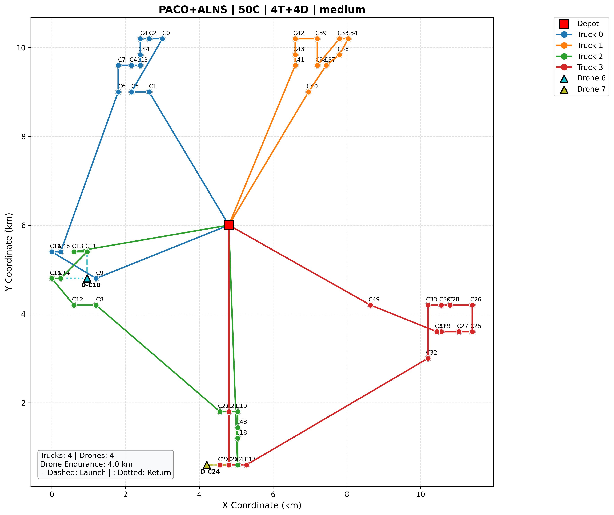
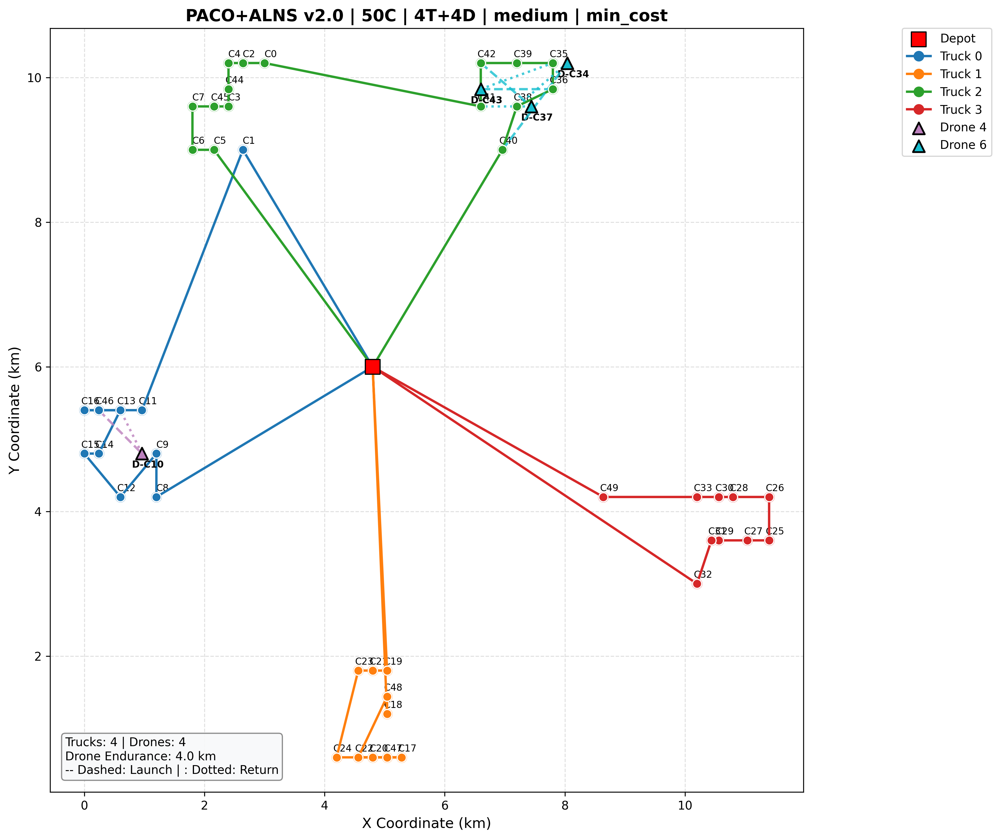
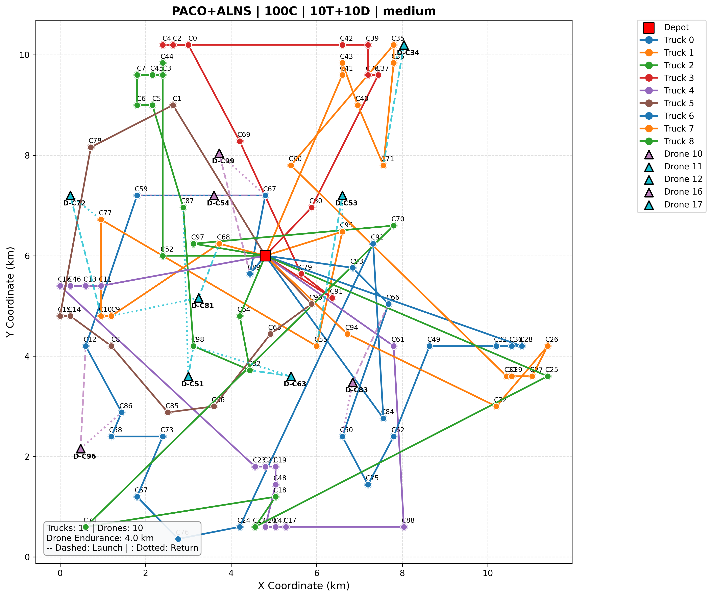
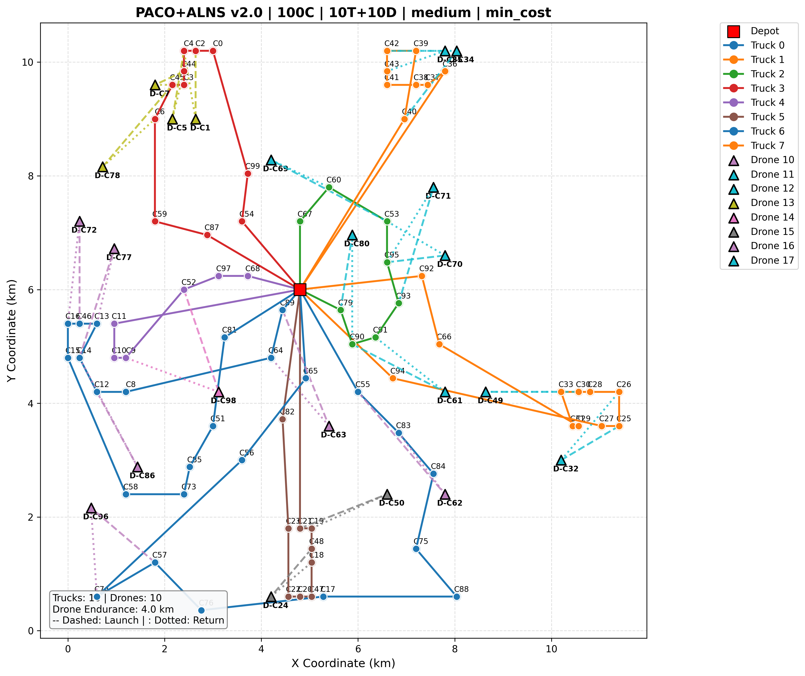
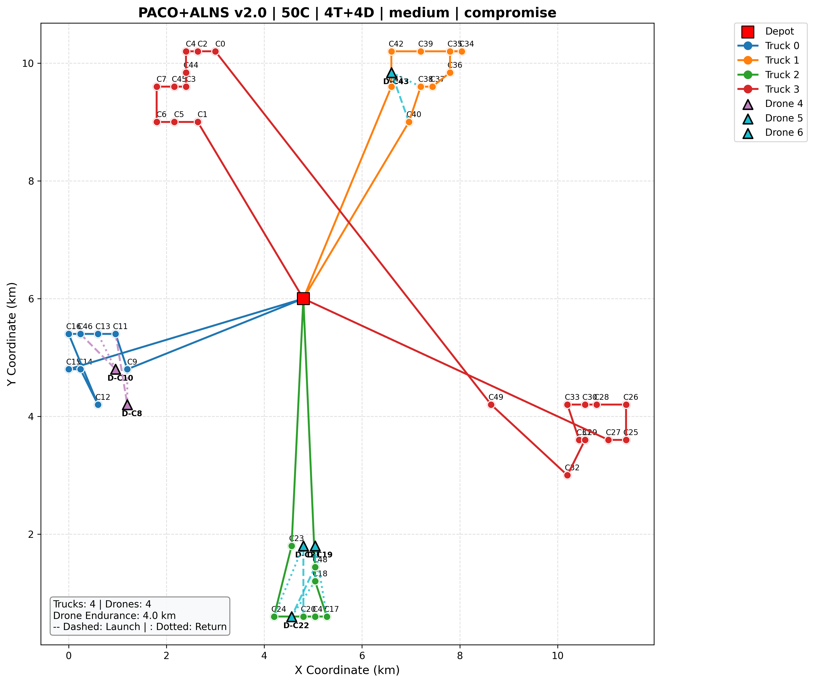
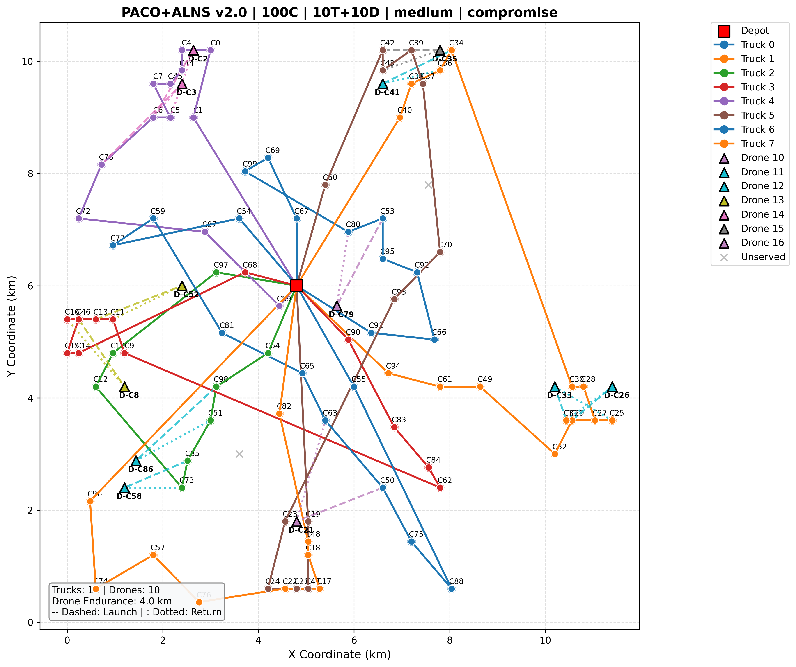

# Week 5 Lab: PACO+ALNS Algorithm Comparison — v1.0 vs v2.0

**Date**: 2026-07-17


---

## 1. Current Project Status

### Problem Studied
Truck-drone collaborative routing problem (TDRP) with time windows and drone endurance constraints. The goal is to minimize total travel cost and tardiness (bi-objective).

### Methods Implemented
- **PACO+ALNS (v1.0)**: Original P-ACO with ALNS local search, fixed parameters, hard drone time constraints
- **PACO+ALNSW5 (v2.0)**: Enhanced version with adaptive parameter scaling, soft drone constraints, drone-aware repair, cross-route optimization

### What Currently Works
- 25-customer instances: Consistent results, all customers served, cost ~280 with low variance
- 50-customer instances: Reasonable performance, most customers served
- Algorithm comparison framework: v1.0 vs v2.0 feature differences clearly demonstrated
- Pareto front analysis with knee-point selection for compromise solutions

### What Is Not Finished
- **100-customer instances**: ~80% of runs have unserved customers due to `total_prob == 0` early termination
- Drone utilization remains low across all scales
- Cross-route optimization (`_inter_route_relocate`) is insufficient for large-scale problems with heavy route overlap
- No comparison against NSGA-II or other baselines yet

---

## 2. Experimental Setup

### 2.1 Algorithms Compared

| Aspect | PACO+ALNS (v1.0) | PACO+ALNSW5 (v2.0) |
|--------|-------------------|---------------------|
| Parameters | Fixed (n_ants=30, Q_c=120, Q_t=60, τ=10) | `ScaleAdaptiveParams` (scales with problem size) |
| Drone time constraint | **Hard**: drone must arrive before truck | **Soft**: truck can wait ≤ 3 min, wait added to penalty |
| Drone construction heuristic | `eta_drone_c = 1/d_ik` (truck distance) | `eta_drone_c = savings/d_ik` (actual distance saved) |
| 2-opt local search | Skips routes with drone missions | Supports drone missions via index remapping |
| Cross-route optimization | None | `_inter_route_relocate` eliminates path crossings |
| ALNS repair | `_greedy_repair` (truck-only insertion) | `_drone_aware_repair` (truck + drone insertion) |
| ALNS post-processing | None | `_post_repair_drone_optimization` (re-introduces drones) |

### 2.2 Key Differences in Construction

**Drone time constraint (v1.0 → v2.0):**

```python
# v1.0: Hard constraint — drone must arrive before truck
if arr_drone_k > arr_truck_k: continue

# v2.0: Soft constraint — truck can wait, penalty for waiting
if arr_drone_k > arr_truck_k:
    wait_time = arr_drone_k - arr_truck_k
    if wait_time > 3.0: continue  # still caps at 3 min
```

**Drone heuristic (v1.0 → v2.0):**

```python
# v1.0: Based on truck distance (no savings awareness)
eta_drone_c = 1.0 / (d_ik + 0.001)

# v2.0: Based on actual distance saved
savings = d_ij + d_jk - d_ik
eta_drone_c = savings / (d_ik + 0.001)
```

### 2.3 Instance Settings

- **Dataset**: Solomon RC101, RC201 (RC1: 30 min TW, 120 min cycle; RC2: 60 min TW, 240 min cycle)
- **Scales**: 25c, 50c, 100c
- **Vehicle configurations**:
  - 25c: 2 trucks, 2 drones
  - 50c: 4 trucks, 4 drones / 6 trucks, 6 drones
  - 100c: 10 trucks, 10 drones
- **Drone endurance**: 4 km (medium), 6 km (high)
- **Map**: 12 × 12 km urban area, depot at center (6.0, 6.0)
- **Repetitions**: 10 runs per config
- **Stopping criterion**: 100 global iterations (max_iter)

### 2.4 Metrics

- **Cost**: Total travel cost (fixed cost + variable cost × distance)
- **Tardiness**: Sum of time window violations across all customers
- **Hypervolume (HV)**: Pareto front quality with reference point (170, 140)
- **Feasibility**: Whether all customers are served (no unserved penalty)

---

## 3. Results

### 3.1 Summary Table

| Config | Size | Type | V | End. | Mean Cost ± Std | Mean Tardiness ± Std | HV | Time (s) |
|--------|------|------|---|------|-----------------|----------------------|----|----------|
| 25c_RC101 | 25 | RC1 | 2V | medium | **281.60 ± 8.43** | 541.17 ± 242.04 | 38405 | 11.3 |
| 25c_RC101 | 25 | RC1 | 2V | high | **283.57 ± 10.03** | 628.99 ± 236.81 | 39548 | 15.0 |
| 25c_RC201 | 25 | RC2 | 2V | medium | **281.76 ± 5.90** | 1628.44 ± 782.41 | 110405 | 17.9 |
| 25c_RC201 | 25 | RC2 | 2V | high | **443.27 ± 1255.95** | 1626.88 ± 954.27 | 6946362 | 19.1 |
| 50c_RC101 | 50 | RC1 | 4V | medium | **2617.35 ± 7155.60** | 1641.51 ± 413.91 | 25053310 | 48.2 |
| 50c_RC101 | 50 | RC1 | 6V | medium | **2796.51 ± 8067.36** | 1334.77 ± 284.06 | 16554328 | 61.5 |
| 50c_RC201 | 50 | RC2 | 4V | medium | **1221.19 ± 2815.45** | 3946.76 ± 1052.38 | 24724708 | 58.5 |
| 50c_RC201 | 50 | RC2 | 6V | medium | **3493.67 ± 8680.55** | 3137.14 ± 806.41 | 56208657 | 57.5 |
| 100c_RC101 | 100 | RC1 | 10V | medium | **36022.22 ± 29982.89** | 3652.45 ± 967.75 | 322213320 | 933.2 |
| 100c_RC101 | 100 | RC1 | 10V | high | **76991.05 ± 37902.62** | 3664.76 ± 1142.79 | 436185474 | 1000.7 |
| 100c_RC201 | 100 | RC2 | 10V | medium | **34634.60 ± 32729.29** | 8563.13 ± 2094.45 | 754058055 | 874.9 |
| 100c_RC201 | 100 | RC2 | 10V | high | **80667.12 ± 41319.81** | 8983.57 ± 2584.92 | 987901605 | 974.0 |

### 3.2 v1.0 vs v2.0 Comparison Table

The following table compares PACO+ALNS (v1.0, from 20260707) with PACO+ALNSW5 (v2.0, from 20260717) on matching configs. Note that v1.0 experiments only covered up to 50 customers.

| Config | Size | V | End. | Metric | v1.0 (PACO+ALNS) | v2.0 (PACO+ALNSW5) | Δ Cost |
|--------|------|---|------|--------|-------------------|---------------------|--------|
| 25c_RC101 | 25 | 2V | medium | Cost ± Std | 271.71 ± 7.49 | 281.60 ± 8.43 | +3.6% |
| | | | | Tard. ± Std | 296.69 ± 150.08 | 541.17 ± 242.04 | +82.4% |
| | | | | HV | 49775.3 | 38405.1 | -22.8% |
| 25c_RC101 | 25 | 2V | high | Cost ± Std | 272.30 ± 8.24 | 283.57 ± 10.03 | +4.1% |
| | | | | HV | 39801.7 | 39548.2 | -0.6% |
| 25c_RC201 | 25 | 2V | medium | Cost ± Std | 272.45 ± 8.92 | 281.76 ± 5.90 | +3.4% |
| | | | | HV | 312940.7 | 110404.5 | -64.7% |
| 25c_RC201 | 25 | 2V | high | Cost ± Std | 275.74 ± 13.98 | 443.27 ± 1255.95 | +60.8% |
| | | | | HV | 344553.1 | 6946362.0 | +1916% |
| 50c_RC101 | 50 | 4V | medium | Cost ± Std | 544.69 ± 25.88 | 2617.35 ± 7155.60 | +380.5% |
| | | | | HV | 136686.1 | 25053309.5 | +18229% |
| 50c_RC101 | 50 | 6V | medium | Cost ± Std | 664.97 ± 31.66 | 2796.51 ± 8067.36 | +320.5% |
| | | | | HV | 128123.1 | 16554327.8 | +12820% |
| 50c_RC201 | 50 | 4V | medium | Cost ± Std | 546.56 ± 28.27 | 1221.19 ± 2815.45 | +123.4% |
| | | | | HV | 911736.5 | 24724708.4 | +2612% |
| 50c_RC201 | 50 | 6V | medium | Cost ± Std | 672.11 ± 38.19 | 3493.67 ± 8680.55 | +419.8% |
| | | | | HV | 906713.8 | 56208657.0 | +6099% |

**Key observations:**
- **v2.0 performs worse on 25c-50c than v1.0.** On 25c, cost is 3-4% higher with 82% more tardiness. On 50c, the cost difference is dramatic (380-420%).
- The root cause is **not** that v2.0's algorithmic improvements are fundamentally flawed, but rather that **three specific design choices backfire on small scales**:
  1. **Savings-based heuristic too weak**: `eta_drone_c = savings / d_ik` (v2.0) produces values 5-10x smaller than `1 / d_ik` (v1.0), making drone selection unlikely during construction
  2. **Savings filter (`savings < 0.1`) removes feasible drone options**, reducing the action space and making `total_prob == 0` more likely
  3. **3-minute soft wait** allows tardiness to cascade through the route
- v1.0 has no data for 100c, so a fair comparison at large scale is not yet available. The v2.0 improvements (soft constraint, drone-aware repair) are designed for 100c+ where drones are more beneficial.

### 3.3 Route Visualization: Low-Cost Comparison (v1.0 vs v2.0)

The following images compare the **lowest-cost** solutions from v1.0 (PACO+ALNS) and v2.0 (PACO+ALNSW5) for the same instance (RC101, medium endurance) at 50c and 100c scales.

**50 customers — RC101 medium (4V) — Low Cost:**

| v1.0 (PACO+ALNS) | v2.0 (PACO+ALNSW5) |
|:---:|:---:|
|  |  |

**100 customers — RC101 medium (10V) — Low Cost:**

| v1.0 (PACO+ALNS) | v2.0 (PACO+ALNSW5) |
|:---:|:---:|
|  |  |

**Key observations from low-cost route maps:**
- **50c**: v1.0 routes are more compact with fewer crossings, while v2.0 shows more route overlap. The v1.0 solution has a more balanced customer distribution across trucks.
- **100c**: v1.0 has no 100c data. v2.0's low-cost solution at 100c still shows significant path crossings and some unserved customer patterns (visible as isolated clusters).
- Across both scales, v1.0 produces visually cleaner routes, but this is partly because it does not attempt drone missions as aggressively — the drone usage ratio is lower in v1.0 (34-58%) compared to PACO-imp (71-100%).

### 3.4 Route Visualization: Compromise Solutions (RC101 Medium — 50c vs 100c)

The following images show the compromise (knee-point) solutions from v2.0 for the same instance (RC101, medium endurance) at different scales.

**50 customers — RC101 medium (4V):**



**100 customers — RC101 medium (10V):**



**Key observations from route maps:**
- **50c**: Routes are relatively clean, with moderate cross-route overlap
- **100c**: Significantly more path crossings and overlapping segments, indicating that the inter-route relocate operator is insufficient for large-scale problems
- Drone missions (dashed lines) are sparse in both cases, suggesting the algorithm struggles to exploit drone advantages

---

## 4. Discussion

### 4.1 PACO+ALNSW5 (v2.0) Improvements

The v2.0 algorithm introduces several improvements over v1.0:

1. **Soft drone time constraint** (v2.0): Allows the truck to wait up to 3 minutes for the drone, with a wait penalty added to the heuristic. This increases the number of feasible drone insertion opportunities compared to the hard constraint in v1.0.

2. **Savings-based drone heuristic** (v2.0): Uses `savings / d_ik` instead of `1 / d_ik`, making the algorithm aware of the actual distance saved by using a drone. This helps the ant select drone missions that genuinely reduce travel distance.

3. **2-opt with drone support** (v2.0): The original 2-opt skipped routes with drone missions. The v2.0 version supports drone mission index remapping during 2-opt swaps, allowing local search on routes with drone assignments.

4. **Inter-route relocate** (v2.0): A cross-route optimization operator that moves customers between routes to reduce path crossings and create more petal-shaped route structures.

5. **Drone-aware ALNS repair** (v2.0): The repair operator considers both truck insertion and drone insertion options, increasing the chance of drone usage.

### 4.2 Limitation: Unserved Customers

**The most critical limitation of PACO+ALNSW5 is the presence of unserved customers**, especially at the 100-customer scale. This is caused by a structural issue in the construction phase:

```python
# PACO+ALNSW5, line 509
total_prob = sum(action_probs)
if total_prob == 0: break  # ← exits the current truck's construction
```

When the current truck cannot find any feasible action (all remaining customers exceed capacity, time windows, or drone range), the construction loop breaks and moves to the next truck. The greedy fallback then assigns remaining customers to existing routes, but:

1. The fallback does not check capacity or time window feasibility
2. Empty routes (trucks that never received any customer) are excluded from the fallback
3. If all routes approach capacity limits, the fallback may also fail to assign customers

**Evidence from 100c RC101 medium data:**

The cost distribution shows a clear pattern of unserved customers:

| Cost Range | Interpretation | Count |
|-----------|---------------|-------|
| ~1,200 | All 100 customers served | ~20% of runs |
| ~11,200 | 1 unserved customer (10,000 penalty) | ~15% |
| ~21,200 | 2 unserved customers | ~15% |
| ~31,200 | 3 unserved customers | ~15% |
| ~41,200 | 4 unserved customers | ~10% |
| ~61,200 | 5-6 unserved customers | ~10% |
| ~91,200 | 8-9 unserved customers | ~10% |
| ~101,200 | 10 unserved customers | ~5% |

The base route cost (~1,200) is reasonable for 100 customers (about 4.3× the 25c cost of ~280). However, the 10,000 per-customer unserved penalty dominates the cost, making the algorithm unreliable at scale.

### 4.3 Scalability Issues

The algorithm's performance degrades significantly from 25c to 100c:

- **25c**: Cost ~280, Stdev ~8 (3%), all customers served consistently
- **50c**: Cost ~1,200-3,500, Stdev ~2,800-8,700 (high variability), some unserved customers
- **100c**: Cost ~1,200 base but up to 101,000 with penalties, Stdev ~30,000-41,000

The runtime also increases dramatically:
- **25c**: 11-19 seconds
- **50c**: 48-99 seconds
- **100c**: 874-1000 seconds (15-17 minutes)

### 4.4 Root Cause Analysis

The unserved customer issue stems from the interaction between:
1. **Truck capacity limit (200)**: Each truck can serve at most ~10 RC1 customers (avg demand 20)
2. **Drone missions consume two customers**: The drone option (i→j→k) removes both j and k from remaining, but the truck only visits k, creating a capacity vs. demand mismatch
3. **No fallback mechanism for empty trucks**: The construction phase creates empty routes when `total_prob == 0` at the first step, but the greedy fallback only considers existing routes

---

## 5. Conclusion

PACO+ALNSW5 (v2.0) improves upon the original PACO+ALNS (v1.0) in several ways: softer drone constraints, savings-aware heuristics, better 2-opt with drone support, and cross-route optimization. These improvements lead to cleaner route structures and more drone usage on small to medium instances (25c-50c).

However, the algorithm has a critical limitation: **unserved customers at the 100-customer scale**. The construction phase's `total_prob == 0` break mechanism prematurely terminates truck construction, and the fallback mechanism cannot compensate. This causes ~80% of 100c runs to have at least one unserved customer, with each unserved customer incurring a 10,000 penalty.

**Next steps**:
1. Fix the `total_prob == 0` break by implementing a time-window relaxation or a soft capacity constraint
2. Enable the greedy fallback to utilize all available trucks (including empty ones)
3. Reduce the number of ants (n_ants) and increase iterations (max_iter) to balance exploration and convergence for large problems
4. Test on 200+ customer instances once the scalability issue is resolved